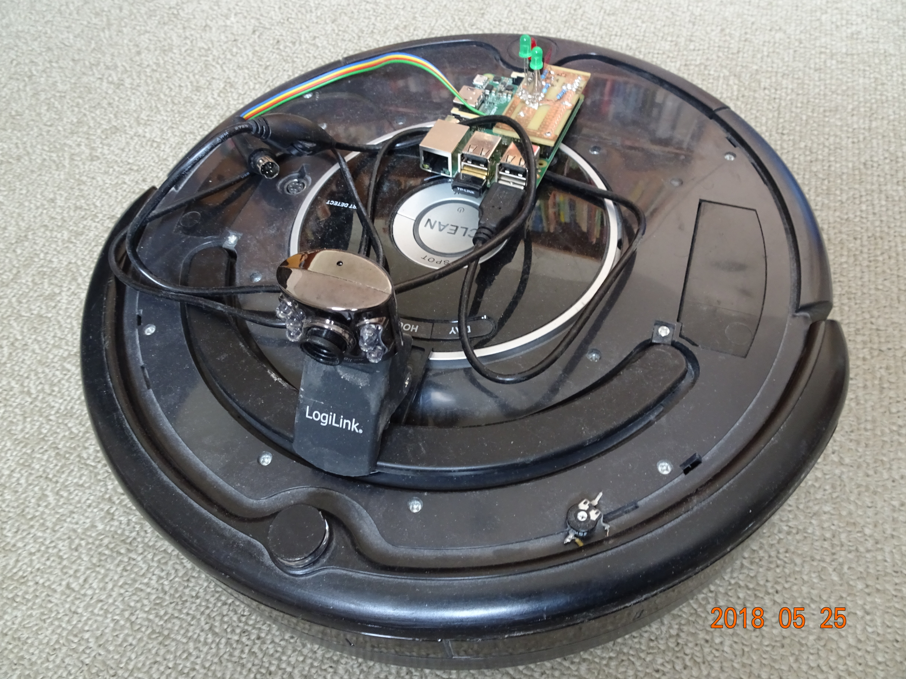

# Autonomous Robot Control with Camera

These programs implement an autonomous robot control using a camera on a Raspberry Pi 2 or 3. The robot can be a Roomba vacuum robot, or a smaller Pimoroni Raspberry Pi STS robot. 
The programs lets the robot drive a random walk, and computes the apparent optical "collision speed" with an object in front from the camera video. If it detects an approaching collision, it turns right by a more or less random angle around 90 degrees, to avoid the collision. It uses a somewhat random angle to avoid getting stuck in tight places.
For estimatin the "collision speed" it uses a sort of "cepstrum", which is mainly used in speech processing and speech recognition (see: https://en.wikipedia.org/wiki/Cepstrum). It computes the 2D DCT to the frames from the camera, and takes the magnitude of it. Large objects appear as large coeffcients at the low frequency regions of the 2D DCT, in the upper left hand corner of it (if the upper left hand corner is the corner corresponds to the indices (0,0)), small objects or fine patterns as hight frequency coefficients further right and down. The position of objects was encoded in the sign of the coefficients, which is removed by the abs operation. Then the inverse 2D-DCT is applied, and again abs is applied. This basically makes the basic shapes of all objects appear in the upper left hand corner. Then the centroid of this result is computed, and its distance from the origin (lenght of the centroid). If this centroid grows, the robot is nearing an object, the faster it grows, the closer it is. If this growth is above some threshold, an immanent collision is detected (collspeedfilt > 1.0) and it turns around.

It also computes the the sum of magnitudes of the high frequency coefficients, to detect if the image is blurred (meaning low high frequency coefficients). That usually means the robot it stuck in front of a wall, and it also turns around. The same is the case if the centroid is hardly changing, then it is also assumed that the robot is stuck and it turns around. This is the if statement with "(np.abs(collspeedfilt)<0.05) or (HFcoeff<1000)".

This approach has the advantage that it is simple and very efficient to compute, such that it can also run on a Raspberry Pi in real time, unlike for instance a "real" optical flow (https://en.wikipedia.org/wiki/Optical_flow).

The program "pihatsts_colldet3hv.py" is for the Pimoroni Raspberry Pi STS robot, the program "roombacolldet3hv.py" for the Roomba robot.
For the Pimoroni Raspberry Pi STS robot, the motor cabling has the be such that it goes straight ahead right after start-up, and only turns left after collision detection (although, turning right wouldn't really make a functional difference).

The programs should work for both, Python2 and Python3. They both use a USB Webcam as camera input.

The video shows the Pimoroni Raspberry Pi STS robot, controlled by pihatsts_colldet3hv.py in action, and the picture below the Roomba with Raspberry Pi and USB Video Camera.

The programs need the opencv library, to be installed with:
* sudo pip3 install opencv-python

The roomba*.py needs the serial library, to be installed with:
* sudo apt install python3-serial

The pihats*.py program needs the explorerhat library, to be installed with:
* sudo pip3 install explorerhat
and 
* sudo apt-get install python3-smbus

For the Roomba robot, a serial interface needs to be build, whose construction is described here:
https://www.tu-ilmenau.de/mt-ams/forschung/aktuelle-projekte/raspberry-pi-serial-interface-for-roomba-robots/
The Roomba serial interface is also described here:
http://www.robotappstore.com/files/KB/Roomba/Roomba_SCI_Spec_Manual.pdf

Gerald Schuller, May 2018.

